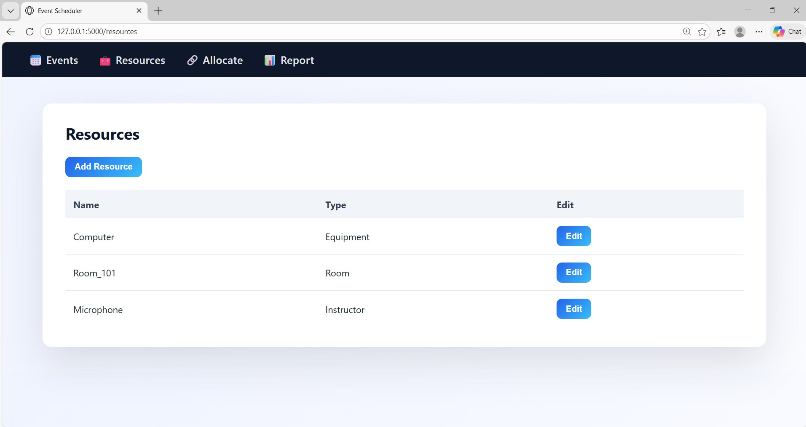
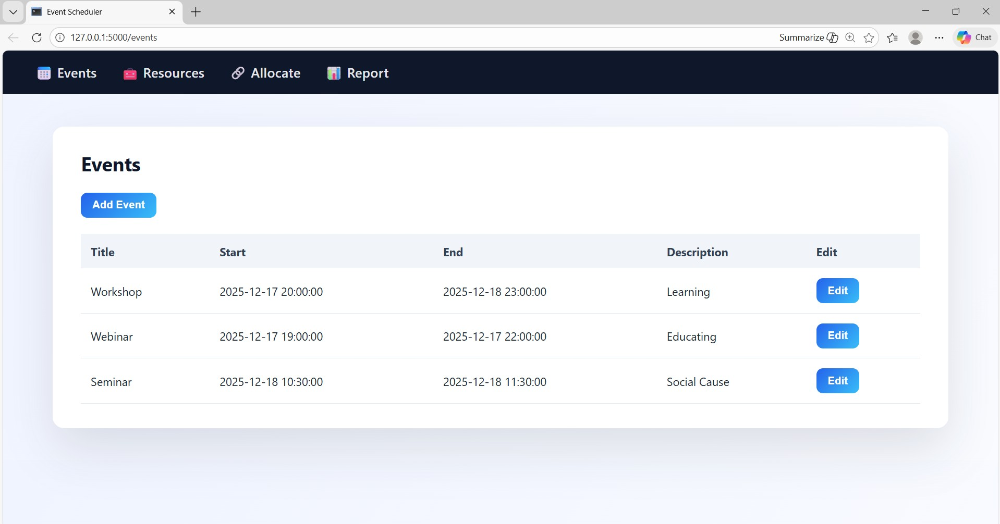
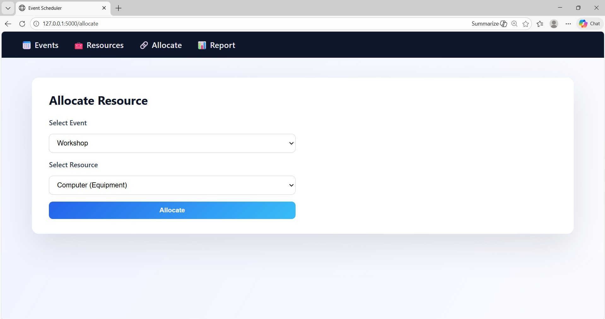
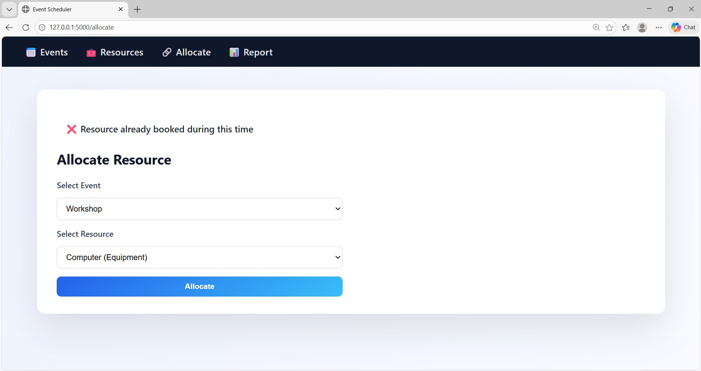
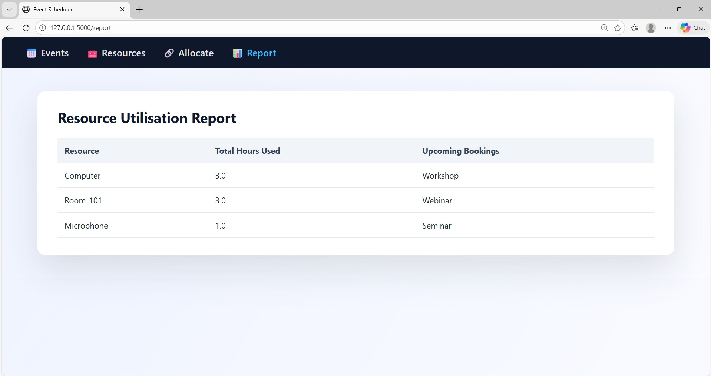

# Flask Event Scheduling & Resource Allocation System

This repository contains screenshots and a demo video of the Flask Event Scheduling & Resource Allocation System.

### 📦 Resource Management

### 🗓️ Event Management

### 📎 Resource Allocation

### ⚠️ Conflict Detection

### 📊 Resource Utilization Report

### 🎥 Demo Video
[Watch Demo Video](demo.mp4) 
